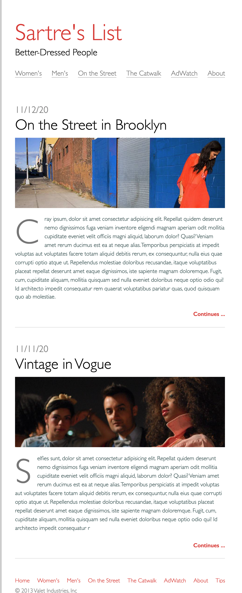

# fashionBlog

## Prerequisites
 - HTML & CSS
 - Flexbox
 - React
 ## Instructions
 
 

 ### Mockup in HTML & CSS
 

 ### Build Your HTML
 1. Create your html boilerplate in the `index.html` file.
 2. Add a new file called `styles.css` and link it to the HTML file.
 3. In the body of your HTML, use `header, main, and footer` tags to clearly define the different parts of the page.
 4. Use an `h1` tag for the site title and an `h2` for the subtitle inside the page header.
 5. Use [`nav`](https://developer.mozilla.org/en-US/docs/Web/HTML/Element/nav) tags inside the page header to create an accessible navigation. Follow the example in the [W3C Web Accessibility Initiative (WAI) Guidelines](https://www.w3.org/WAI/tips/developing/#provide-meaning-for-non-standard-interactive-elements) to format your navigation:
 - Wrap each link in an anchor tag
 - Wrap each anchor tag in a list item
 - Wrap all of the list item tags in an unordered list tag
 - Place the unordered list inside the the nav tag and give it attributes for `aria-label="Main Navigation"` and `role="navigation"`

 6. Mark up both of the blog posts using the [`article`](https://developer.mozilla.org/en-US/docs/Web/HTML/Element/article) tag.
 7. Use this [W3C WAI Guideline](https://www.w3.org/WAI/tips/developing/#use-mark-up-to-convey-meaning-and-structure) example, to help you structure your blog post content. Follow the pattern! Make sure there is a `p` tag that contains some lorem ipsum text (Remember you can create this with Emmet by typing `p>lorem` and pressing tab)!
 8. Make sure your images all have `alt` attributes so that they are accessible.
 9. Inside the page footer, use the same technique you used earlier to create a semantic and accessible navigation, using a wrapping `nav` tag, unordered list and the aria attributes.
 10. Add a copyright in the `footer`. For the &copy; symbol, use an [html entity](https://www.w3schools.com/html/html_entities.asp).